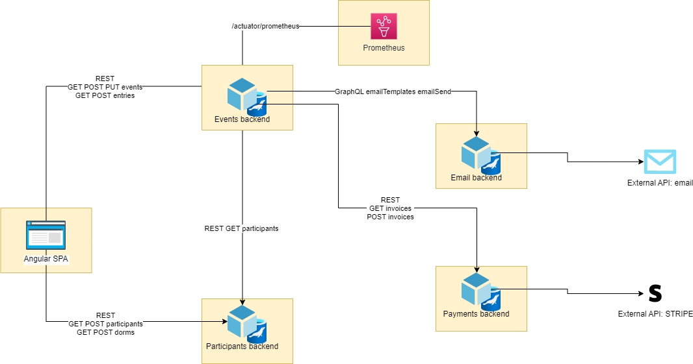

# Sistem za organiziranje prijav na dogodke v okviru Majskih iger

__Matjaž Bizjak, Jakob Marušič__

__Računalniške storitve v oblaku, 2022/23__

## Opis projekta

Sistem je namenjen organizacijski ekipi Majskih iger. Majske igre so tritedenski športno, kulturno, zabavni dogodek. Osrednji element dogodkov je meddomsko športno tekmovanje v več kot 40 športnimi disciplinami, v katerih tekmujejo stanovalci Študentskih domov Ljubljana.

Sistem za organizacijo prijav na dogodke omogoča organizatorjem kreiranje dogodkov in sodelujočih ter kreiranje prijav na posamezne dogodke. Hkrati se ob prijavi generira račun za vsakega izmed udeležencev v zunanji storitvi Stripe, poleg tega vsak udeleženec dogodka prejme potrditev vpisa na elektornski naslov.

## Ogrodje in razvojno okolje

Za razvoj zalednih mikrostoritev je bilo uporabljeno ogrodje __Spring Boot__. Za shranjevanje podatkov mikrostoritve uporabljajo podatkovno bazo MariaDB, do katere dostopajo preko vmesnika JPA in Hibernate.

Za razvoj čelnega dela sistema je bilo uporabljeno ogrodje __Angular__, ki znotraj lastnega vmesnika uporablja nginx spletni strežnik. Pri razvoju je bilo uporabljeno tudi ogrodje Bulma za hitro prototipiranje stilov.

Za razvoj CI/CD smo uporabili __Github actions__ in __Dockerhub__.

Pri razvoju čelnih in zalednih mikrostoritev je bilo uporabljeno razvojno okolje __IntelliJ__.

## Povezave do repozitorijev

### Zaledne storitve

| Ime storitve | Tip storitve | GitHub (izvorna koda) | DockerHub |
| ------------ | ------------ | --------------------- | --------- |
| Events backend | Spring Boot mikrostoritev | [https://github.com/RSO-majske-igre/events_backend](https://github.com/RSO-majske-igre/events_backend) | [https://hub.docker.com/r/bizjak3/events_backend](https://hub.docker.com/r/bizjak3/events_backend) |
| Email backend | Spring Boot mikrostoritev | [https://github.com/RSO-majske-igre/email_backend](https://github.com/RSO-majske-igre/email_backend) | [https://hub.docker.com/r/bizjak3/email_backend](https://hub.docker.com/r/bizjak3/email_backend) |
| Payments backend | Spring Boot mikrostoritev | [https://github.com/RSO-majske-igre/payment_backend](https://github.com/RSO-majske-igre/payment_backend) | [https://hub.docker.com/r/bizjak3/payments_backend](https://hub.docker.com/r/bizjak3/payments_backend) |
| Participant backend | Spring Boot mikrostoritev | [https://github.com/RSO-majske-igre/users_backend](https://github.com/RSO-majske-igre/users_backend) | [https://hub.docker.com/r/bizjak3/users_backend](https://hub.docker.com/r/bizjak3/users_backend)

### Čelne storitve

| Ime storitve | Tip storitve | GitHub (izvorna koda) | DockerHub |
| ------------ | ------------ | --------------------- | --------- |
| Angular aplikacija | spletna stran | [https://github.com/RSO-majske-igre/frontend](https://github.com/RSO-majske-igre/frontend) | [https://hub.docker.com/r/bizjak3/frontend](https://hub.docker.com/r/bizjak3/frontend) |

### Repozitoriji konfiguracije

| Ime storitve | Tip storitve | GitHub (izvorna koda) |
| ------------ | ------------ | --------------------- |
| k8s | Konfiguracija Kubernetes | [https://github.com/RSO-majske-igre/k8s](https://github.com/RSO-majske-igre/k8s) |
| spring_cloud | Konfiguracija Spring Cloud | [https://github.com/RSO-majske-igre/spring_cloud](https://github.com/RSO-majske-igre/spring_cloud) |

## Shema arhitekture in iterakcij

## Funkcionalnosti sistema

### Events backend

1. __Kreiranje in pregled lokacij__ `/locations`: uporabnik ima možnost kreiranja lokacij dogodkov in pregleda lokacij. Poleg kreacije podpira zahteva `POST`tudi posodabljanje lokacije (glede na to ali je prisoten `UUID` v zahtevi).

2. __Pregled dogodkov s paginacijo__ `GET /events`: storitev omogoča pregled dogodkov v paginiranem pogledu, z možnostjo sortiranja po kateri koli izmed lastnosti.

3. __Pregled posameznega dogodka__ `GET /events/{uuid}`: storitev omogoča pregled posameznega dogodka.

4. __Kreiranje in posodabljanje dogodka__ `POST & PUT /events`: storitev omogoča kreriranje in posodabljenje posameznega dogodka.

5. __Pregled in kreiranje prijav na dogodek__ `GET & POST /entries`: storitev omogoča pregled posamezne prijave in dodajanje oz. posodabljanje obstoječe (glede na prisotnost `UUID` v zahtevi).

6. __Fasada za pregled posameznega udeleženca, kreiranje in posodabljanje__ `GET & POST & PUT /participants`: storitev lahko služi kot fasada za nadaljne klice na mikrostoritev `ParticipantsBackend`.

### Participants backend

1. __Pregled domov__ `GET /dorms`: storitev omogoča pregled seznama domov in posameznega doma.

2. __Kreiranje in posodabljanje doma__ `POST & PUT /dorms`: storitev omogoča kreriranje in posodabljenje posameznega doma.

3. __Pregled seznama udeležencev in posameznega udeleženca__ `GET /participants`: storitev omogoča pregled seznama udeležencev (v paginacijskem načinu) in posameznega udeleženca.

4. __Dodajanje in posodabljenja udeleženca__ `POST & PUT /participants`: storitev omogoča kreiranje in posodabljanje posamezenega udeleženca.

5. __Pridobitev seznama udeležencev glede na UUID__ `PUT /participants/find-by-ids`: storitev omogoča dostop do seznama posameznih udeležencev, glede na podane vhodne `UUID`.

### Payments backend

1. __Pridobivanje seznama računov in posameznega računa__ `GET /invoice`: storitev omogoča pregled seznama Stripe računov (v paginaciji) in posameznega računa.

2. __Kreiranje računov__ `POST /invoice`: storitev omogoča kreacijo Stripe računov.

### Email backend

Stroitev omogoča preko `GraphQL` kreiranje email predlog in pošiljanje predlog uporabnikom.

## Implementirani primeri uporabe

Implementirani primeri uporabe preko čelnega sistema:
- uporabnik doda nov dom in ga posodobi
- uporabnik pregleduje seznam domov in posamezen dom
- uporabnik pregleduje seznam lokacij in posamezno lokacijo, lokacijo lahko doda in ureja
- uporabnik pregleduje seznam udeležencev in posameznega udeleženca, udeleženca lahko doda in ureja
- uporabnik lahko pregleduje paginirane dogodke in posemezen dogodek, dogodek lahko doda in ureja
- uporabnik lahko pregleduje prijave posameznega dogodka, jih doda in ureja
- pri dodajanju nove prijave ali urejanju udeležencev prijave, se v zalednem sistemu kreirajo računi in pošljejo v zunanji Stripe sistem

Ostali implementirani primeri uporabe:
- uporabnik preko GraphQl doda novo epoštno predlogo
- uporabnik preko GraphQl zahteva pošiljanje epoštne predloge, pri tem se uporabi zunanji API za pošiljanje elektronskih sporočil

## Namestitev na Kubernetes

Za oblačnega ponudnika smo izbrali Google cloud. Vse konfiguracijske datoteke so dostopne na zgoraj navedenem github repozitoriju (glej "Repozitoriji konfiguracije")
Aplikacija je dostopna na http://34.107.204.219/.
Zaledni del aplikacije lahko dostopamo na naslednjih naslovih:
- Events_backend: http://34.168.255.49:8120/
- Users_backend: http://34.168.57.248:8110/
- Email_backend: http://34.168.255.49:8120/
- Payments_backend: http://34.168.23.255:8100/
Za pregled metrik smo izpostavili še prometheus in graphana na naslovu http://34.111.151.169/ in http://34.117.227.122/.

## Uporaba konfiguracij

Sistem uporablja konfiguracijski strežnik, ki omogoča dinamično sprmeinjanje konfiguracij. Če mikrostoritev ne more dostopati do konfiguracijskega strežnika, se uporabi konfiguracija definirana v standardni konfiguracijski datoteki `application-*.properties`.

## Kontrole zdravja in metrike

### Kontrole zdravja

Vse mikrostoritve podpirajo standard, ki ga zagotavlja `Spring Boot Actuator`, med drugim tudi preverjanje zdravja mikrostoritev. To je dostopno na naslovu `/actuator/health`.

Mikrostoritve javljajo samo osnovno kontrolo zdravja z izjemo `EventsBackend`, ki ima vključeno podrobno javljanje kontrole zdravja. Preko tega dostopa vidimo, da so implementirane naslednje kontrole:
- povezava na podatkovno bazo `db`
- kontrola zdravja diska z informacijami `diskSpace`
- `ping`

Poleg tega `EventsBackend` implementira še dve po meri kontrole zdravja, ki preverjajo zdravje mikrostoritev `ParticipantBackend` (`participantsMicroservice`) in `PaymentsBackend` (`paymentsMicroservice`).

### Metrike
Mikrostoritev `EventsBackend` preko dostopa `/actuator/prometheus` javlja naslednje po meri metrike:
- `events__getEventsRequestsCounter` števec vseh zahtevkov na `/events`
- `external__payments__invoiceCreation_success` in `external__payments__invoiceCreation_fail` števca uspešno in neuspešno izvedenih klicev na `PaymentsBackend` z zahtevami po kreaciji računov
- `external__payments__invoiceCreation_requestTime` časomer trajanja kreiranja računov, pri čemer izključujemo najkrajših 25% in najdaljši 5%
- `entries__post` časomer trajanja kreiranja prijave, pri čemer izključujemo najkrajših 25% in najdaljši 5%

MEtrike se zbirajo v Prometheus in so dostopne preko GibanaUI.

## Zunanji API-ji

Sistem uporablja dva zunanja APIja:
1. __Stripe API__ omogoča kreiranje računov v zunanjem sistemu Stripe. V produkcijski aplikaciji bi s temi računi udeleženci poravnali prijavnino, webhooks storitve omogočajo sporočanje posvratnih dogodkov.

2. __Email API__ omogoča pošiljanje email sporočil preko standardnega komunikacijskega protokola SMTP.

## OpenApi dokumentacija
Mikrostoritve implementirajo standarden prikaz OpenAPI REST storitev na naslovu `/openapi`, dokumentacija je na voljo v `.json` in `.yaml`˙formatu.

SwaggerUI je za vse mikrostoritve, ki implementirajo REST API dostopen na naslovu `/openapi.html`.

## Centralizirano beleženje dnevnikov
Kratek opis centraliziranega beleženja dnevnikov v vaši aplikaciji.

TODO: še ni implementirano

## Izolacija in toleranca napak

Izolacija in toleranca napak je implementirana v mikrostoritvi `EventsBackend`, kjer implementiramo CircuitBreaker pri zahtevah na druge storitve. Uporabljamo ga pri kreiranju računov in pri kontrolah zdravja po meri, kjer kličemo ostale storitve.
